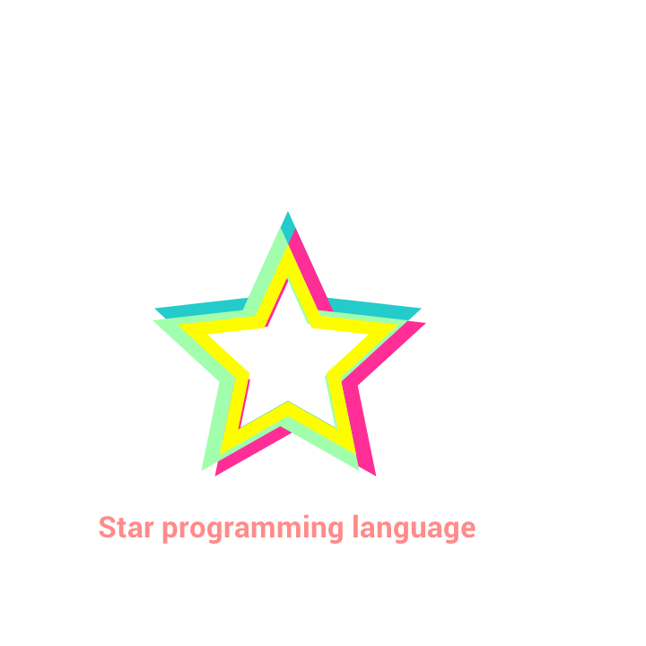

  

Server side, headless and standalone programming language that should solve the following problems: 

- Very high abstraction
- Separation of concerns
- Avoiding project configurations such as in popular PHP frameworks
- Integration of software versioning with functionality/feature inheritance
- Source code binding with built in testing framework
- Self convertible primary data as object
- Self convertible objects
